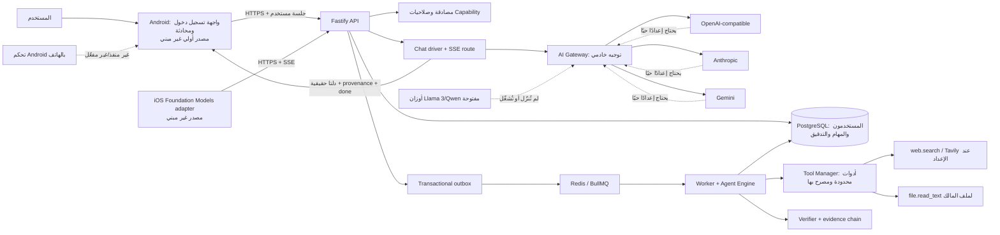

# مخطط حالة مشروع Lazaynova بالتفصيل

**آخر تحديث:** 2026-10-01
**الخلاصة:** توجد قاعدة Backend واسعة ومختبرة باختبارات برمجية، ومصدر أولي لتطبيق Android متصل بمسار المحادثة الحقيقي. لكن المشروع **ليس جاهزًا للإطلاق أو للاستخدام الكامل على الهاتف**: لم تُشغّل خدمات PostgreSQL/Redis أو مزود AI حي، ولم يُبنَ Android أو iOS، ولا توجد أوزان Llama 3/Qwen أو خدمة استدلال محلية. تدريب نموذج من الصفر مؤجل حسب آخر توجيه، والتحكم بالهاتف غير منفذ.

> هذه الخريطة تفصل بين «موجود في الكود»، و«اجتاز اختبارات محلية»، و«تحقق فعليًا على خدمات/أجهزة حقيقية». نجاح اختبارات doubles لا يثبت جاهزية تشغيل الإنتاج.

## 1. صورة المعمارية الحالية

**مسار المحادثة الحقيقي:** Android (مصدر الواجهة الحالي) ← جلسة Bearer للمستخدم ← `POST /v1/lazaynova/chat/stream` ← فحص صلاحية CHAT وجاهزية السائق ← توجيه النموذج من إعدادات الخادم ← deltas فعلية من بروتوكول المزود ← أحداث `delta`, `result`, `done`. لا يختار العميل النموذج، ولا تُقسّم إجابة مكتملة اصطناعيًا.

**مسار المهام غير الفورية:** API ← فحص الصلاحية والجاهزية ← معاملة PostgreSQL للطلب وoutbox ← Redis/BullMQ ← Worker/Agent Engine ← Tool Manager/السائق ← التحقق والأدلة ← تخزين الحالة والنتيجة. هذا المسار مكتوب ومغطى باختبارات، لكنه لم يُختبر على PostgreSQL/Redis حيّين.

## 2. ما تم بناؤه

| المجال | الموجود في المستودع | حدود التحقق الحالية |
|---|---|---|
| Backend وAPI | TypeScript/Fastify، طبقات domain/application/infrastructure، API للمصادقة والمهام والصلاحيات والأدوات والملفات وworkflow. | Typecheck وBuild وLint واختبارات محلية ناجحة؛ لا توجد بيئة Backend حية موصولة. |
| الحسابات والجلسات | تسجيل دخول، تخزين hash للجلسة بدل bearer token، إبطال الجلسة، أدوار وصلاحيات لكل capability، تحقق صارم ومحددات معدل. | اختبارات API/وحدات؛ قاعدة PostgreSQL لم تُشغّل هنا. محدد المعدل process-local وليس موزعًا أفقيًا. |
| Chat الحقيقي | جلسات مستخدم، transcript محدود، رفض حقول/اختيار النموذج من العميل، SSE end-to-end، أخطاء آمنة وإلغاء عند قطع العميل. | مسار HTTP مختبر؛ استدعاء المزود الفعلي غير مختبر لعدم وجود أسرار/حساب حي. |
| AI Gateway والمزودون | واجهات محايدة، profiles وتوجيه خادمي، adapters لـOpenAI-compatible وAnthropic Messages وGemini، فحص قوائم النماذج وprovenance/usage. | عقود المزودين مختبرة بـfetch doubles فقط؛ لا توجد أوزان أو بيانات اعتماد أو استضافة AI مهيأة. |
| بث الرموز/الدلتا | parser SSE محدود الحجم ويدعم UTF-8/تقسيم chunks، تدفق أصلي من adapters الثلاثة، أحداث delta وإكمال، رفض الاستجابة المبتورة، وتمرير الإلغاء. | الاختبارات تستخدم تدفقات HTTP مصطنعة مطابقة للبروتوكول؛ لا يوجد تحقق حيّ مع حساب مزود. |
| Agent Engine — Phase 2 | مخطط DAG محدود، ترتيب dependencies، planner افتراضي من عقدة واحدة، planner اختياري من نفس capability، retries محدودة، leases/checkpoints، إلغاء، evidence chain/verifier. | Unit/SQL doubles؛ migration وقفل/استعادة worker على PostgreSQL/Redis حقيقيين غير مختبرين. لا يوجد تخطيط cross-capability من النموذج. |
| Tool Manager — Phase 3 | أدوات ثابتة فقط: `web.search` و`file.read_text`، grant منفصل، إعادة فحص الصلاحيات، تحقق المدخلات/المخرجات، timeout، audit بلا محتوى، حصص استدعاء دائمة في SQL. | الحصص 20 بحث/دقيقة و200/UTC day، و30 قراءة ملف/دقيقة و500/UTC day؛ هذه حصص عدد استدعاءات لا ميزانية مالية. التزامن الفعلي على PostgreSQL لم يُختبر. لا توجد أدوات عامة أو shell. |
| Usage/Cost per-user — Phase 2 | migration `009` وسجل content-free، نسب موثوق إلى المستخدم، tokens حسب provider/model، تعرفة model يضبطها المشغل، dedupe بمعرف المزود، وواجهتا ملخص للمستخدم/admin. Tavily يسجل الاستجابة المقبولة قبل parsing مع تعرفة اختيارية لكل نداء. | 196 اختبارًا محليًا يمر؛ PostgreSQL/migration `009` ومزود AI/Tavily حي غير متحقق. التكلفة تقديرية لا فاتورة أو حد إنفاق؛ الموديلات غير المسعّرة وTavily بلا تعرفة تبقى غير مسعرة بوضوح. |
| Web Research | adapter اختياري لـTavily، نتائج ومصادر HTTPS، توثيق hash، استدعاء `web_search` واحد ومحدد عبر Tool Manager. | يتطلب مفتاحًا وتوجيه نموذج؛ لا توجد خدمة/اعتمادات حية. |
| الملفات | رفع TXT/Markdown/log/CSV حتى 32 KiB، تشفير AES-256-GCM ومفاتيح ملف مغلفة، owner scoping، فحص سلامة وإثبات مصدر. | اختبارات وحدات/HTTP؛ PostgreSQL والمفتاح التشغيلي والنسخ الاحتياطية غير مهيأة. PDF/Office/صور وفحص malware غير متوفرة. |
| Workflow — المسار الحالي | تعريفات نسخ immutable، outbox وworker منفصل، موافقة/رفض مالك، إلغاء، leases/checkpoints، حتى 4 خطوات مستقلة بالتوازي، وSSE لحالة التقدم فقط مع polling خادمي كل ثانية. بوابة الموافقة توقف طبقة التنفيذ الجاهزة كاملة قبل بدء آثار جانبية. | تغطية unit/HTTP فقط؛ migrations `007` و`008` وتعافي PostgreSQL/Redis والتزامن الحي غير متحقق. SSE يقرأ DB بالpolling وليس LISTEN/NOTIFY. |
| Android | مصدر أولي في `android/`: واجهة عربية RTL، تسجيل دخول، token مشفر بمفتاح Android Keystore، HTTPS، SSE فعلي، إيقاف التدفق. | XML وفحوص manifest ساكنة فقط. لم يُبنَ APK ولم تُشغّل اختبارات أو Android lint أو emulator/device. لا يوجد تحكم بالهاتف. |
| iOS | Swift Package يربط Foundation Models مع Chat API ويستهلك SSE deltas. | لم يُبنَ ولم يُختبر؛ Swift/Xcode وSDK المطلوب غير متاحة. |
| النشر | ملفات Docker Compose خاصة تشمل API/Worker/PostgreSQL/Redis/migrations واختيار Ollama اختياري. | YAML فُحص؛ Docker build/start غير منفذ. لا يوجد خادم خاص مُسلّم أو نموذج مُنزّل. |

## 3. حالة المراحل

> هذا الجدول يحتفظ بترقيم بناء القدرات السابق (0–6) للتوثيق التاريخي؛ الترتيب التنفيذي الحالي الذي وجّهت به هو **Phase 2 → Phase 3 → Phase 4 → Phase 5 → Phase 1 أخيرًا** كما في القسم 8.

| المرحلة | الحالة | المتبقي الأساسي |
|---|---|---|
| 0 — فحص المستودع | مكتملة | لا شيء في الفحص الأولي. |
| 1 — Backend foundation | الكود والتنفيذ الأساسي موجودان | تشغيل migrations وخدمات حقيقية، نشر endpoint، وربط مزود حي والتحقق منه. |
| 2 — Agent Engine | منفذ ومغطى باختبارات doubles | PostgreSQL/Redis/BullMQ recovery، concurrent claims، lease expiry، redelivery، وإلغاء حي. |
| 3 — Tool Manager | منفذ للأدوات المحدودة فقط | اختبار SQL والحصص والتزامن على PostgreSQL، SSRF/abuse tests، وإضافة أدوات جديدة فقط بعد مراجعة مستقلة. تقدير تكلفة المزود لكل مستخدم موجود ككود واختبارات محلية في Phase 2، لكن migration غير مطبق حيًا ولا توجد حدود إنفاق مالية enforcement. |
| 4 — Workflows (ترقيم البناء السابق) | تعريفات/تشغيل/موافقات منفذة، حتى 4 عقد مستقلة بالتوازي وSSE للحالة فقط | تشغيل migrations `007–008` وفحص outbox والسباقات والتعافي على خدمات حقيقية. Adapter sandbox موجود لكنه غير موصول بمدير workspace أو Coding driver. |
| 5 — Memory/RAG/Object Storage | غير منفذة | سياسة ذاكرة وموافقة واحتفاظ/حذف وتشفير، RAG بمصادر موثقة، وS3 بعد تحديد سياسات المفاتيح والنسخ. |
| 6 — Android | واجهة ومصدر Chat أولي فقط | توفير JDK/Gradle/Android SDK، compile، tests/lint، اختبار emulator وجهاز حقيقي، ثم مراجعة نشر وتوقيع APK. |
| نموذج محلي مفتوح الأوزان | مخطط فقط | اختيار/مراجعة ترخيص Llama 3 أو Qwen، توفير الأوزان وخدمة استدلال Ollama خاصة، ثم فحص الجودة والسلامة والحمل. لا توجد أوزان/خدمة حاليًا؛ التدريب من الصفر مؤجل. |
| التحكم بالهاتف | غير منفذ | تصميم صلاحيات Android محدودة، foreground ظاهر، إجراءات typed/allowlisted، إلغاء، تدقيق، وفحوص أمان. لا root أو تحكم خفي أو تجاوز موافقات النظام. |

## 4. Android: الموجود وما ليس موجودًا

**الموجود كمصدر:** تطبيق chat-first، تسجيل دخول بخادم يحدده المستخدم على HTTPS، تخزين آمن للجلسة في Keystore، رسائل محدودة، parser SSE، إظهار provenance، زر إيقاف. مسار اختيار النموذج server-side فقط.

**غير موجود:** APK مُجمّع، توقيع إصدار، نشر Play Store، اختبارات جهاز، صلاحيات Contacts/Media/Accessibility، إنشاء ملفات PPTX، تحكم بالمكالمات/الرسائل/الإعدادات، أتمتة بالخلفية، RAG أو ذاكرة.

**الأمان المطلوب لأي تحكم مستقبلي:** جهاز يملكه المستخدم، موافقات OS الرسمية لكل تكامل، جلسة foreground ظاهرة، أوامر typed محددة، إمكانية إيقاف فورية، لا جمع مستمر للشاشة، ولا قراءة كلمات مرور/OTP أو تجاوز dialogs. العمليات الحساسة مثل الإرسال أو الحذف أو الشراء تحتاج خطوة حماية/تأكيد مناسبة؛ لا يمكن الوعد بتحكم مطلق صامت وآمن.

## 5. النموذج المملوك للمنصة

حاليًا توجد **واجهات وموجهات خادمية** لمزودات OpenAI-compatible/Anthropic/Gemini، وليست أوزانًا مملوكة للمنصة. خدمة Ollama في Compose اختيارية فقط ولا تحتوي نموذجًا أو weights تلقائيًا. التوجيه الأحدث يؤجل التدريب من الصفر ويركز على وزن مفتوح جاهز مثل Llama 3 أو Qwen، لكن لا توجد أوزان أو خدمة Ollama مُهيأة أو موارد استدلال متاحة هنا.

حتى يصبح ذلك مشروعًا فعليًا يلزم، على الأقل:

1. تعريف الاستخدام واللغات والسعة/latency/الخصوصية المرادة.
2. بيانات تدريب وتقييم مرخصة أو مملوكة، مع إزالة البيانات الحساسة وخطة governance.
3. تحديد architecture/tokenizer والقدرة المستهدفة وحوسبة GPU وتكلفتها.
4. pipeline تدريب/checkpointing، تجارب قابلة لإعادة الإنتاج، تقييمات عربية/سلامة وأمن وred-team.
5. model-serving منفصل، توثيق/versioning للأوزان، قياس الاستخدام والتكلفة، مراقبة وخطة rollback.
6. اختبارات جودة وخصوصية وأمن قبل ربطه بمسار Chat أو أدوات/هاتف.

**لا يوجد نموذج فعلي أو تدريب أو أوزان في المستودع الآن**؛ ولا تُختلق إجابات أو readiness لتغطية غيابها.

## 6. ما الذي يلزم حتى نقول إن المشروع كامل؟

### أ. إغلاق مانع Android
- تجهيز JDK 17 وGradle 9.4.1 وAndroid Gradle Plugin 9.2.0 وAndroid SDK Platform 37.
- تشغيل `gradle -p android :app:assembleDebug`, `:app:testDebugUnitTest`, و`:app:lint`، إصلاح أي أخطاء، وإضافة اختبارات API/parser/session.
- تجربة دخول حقيقي، انتهاء الجلسة، storage encryption، قطع الشبكة/إلغاء التدفق، RTL، تدوير الشاشة، خلفية التطبيق، وشهادات TLS على emulator وجهاز.
- إعداد signing/release، سياسة الخصوصية، معالجة الأعطال، accessibility للتطبيق نفسه، وفحص APK قبل التوزيع.

### ب. إغلاق مانع Backend/تشغيل
- تشغيل PostgreSQL وRedis/Docker في بيئة staging وتطبيق migrations `001–009`.
- اختبار العزل بين المستخدمين، transactions/outbox، grants وquotas المتزامنة، workflow approvals، lease expiry، redelivery، shutdown/cancellation، والنسخ الاحتياطي والاستعادة.
- إعداد HTTPS ونطاق وخزائن أسرار وrate limiting موزع ومراقبة وتنبيهات وخطة استجابة/استعادة.
- توفير حساب/endpoint مزود حقيقي أو نموذج self-hosted، ثم اختبار readiness/model inventory/stream/usage/errors والحدود والتكلفة. لا توجد هذه البيانات هنا.

### ج. تفعيل نموذج محلي جاهز
- مراجعة ترخيص Llama 3/Qwen بالنسبة للاستخدام المقصود، ثم توفير أوزان موثوقة وخدمة استدلال خاصة (مثل Ollama) مع تثبيت الإصدار/checksum.
- اختبار التحميل والاستهلاك العربي والسلامة والخصوصية والـlatency والسعة والتوقف/الرجوع. لا يوجد ملف وزن أو خدمة محلية الآن، لذا يبقى `AI_CHAT_PROVIDER` غير مضبوط.
- تدريب نموذج من الصفر مؤجل؛ لا يبدأ إلا بطلب لاحق وموارد بيانات وحوسبة مستقلة.

### د. ميزات المنتج غير المنفذة
- Memory/RAG وS3/سياسات retention.
- Coding sandbox مع عزل CPU/RAM/network/filesystem والأسرار.
- توسيع اللغات وتجربة Android وتكاملات الملفات.
- تحكم الهاتف كمرحلة منفصلة ومحدودة؛ لا يعتبر جزءًا جاهزًا من chat أو من مجرد وجود Android UI.

## 7. نتائج التحقق المسجلة

| الفحص | النتيجة | ماذا تثبت؟ |
|---|---|---|
| `npm test` داخل backend | **PASS — 196 اختبارًا، 0 فشل** | منطق وحدود API مع mocks/doubles؛ لا يثبت اتصال AI أو PostgreSQL/Redis حي. |
| `npm run typecheck` | **PASS** | TypeScript backend سليم نوعيًا في آخر تحقق مسجل. |
| `npm run lint` | **PASS** | ESLint backend بلا تحذيرات في آخر تحقق مسجل. |
| `npm run build` | **PASS** | بناء TypeScript backend في آخر تحقق مسجل. |
| `npm audit` | **PASS — 0 vulnerabilities** | تقرير الاعتمادات الموجودة في Backend وقت التحقق فقط. |
| `git diff --check` وwhitespace | **PASS** | لا توجد مسافات بيضاء مخالفة في الملفات المفحوصة. |
| Android XML/static manifest | **PASS جزئي** | Manifest صالح؛ `INTERNET` فقط، cleartext محظور وbackup معطل. لا يثبت compile أو runtime. |
| Android Gradle build/tests | **BLOCKED** | `gradle` وJava وSDK غير موجودة؛ لا APK. |
| Swift package | **NOT RUN** | Swift/Xcode/SDK غير متاحة؛ لا ادعاء نجاح بناء iOS. |
| DB migrations/Docker/provider حي | **NOT RUN** | الخدمات أو الأسرار أو الأدوات غير مهيأة. |

## 8. حالة تنفيذ الخطة الخماسية الأخيرة — الترتيب المعدّل

**ترتيب التنفيذ الملزم:** Phase 2 → Phase 3 → Phase 4 → Phase 5 → Phase 1 أخيرًا. تم تأجيل Phase 1 الحية عمدًا، وليست بوابة تمنع العمل المحلي على المراحل الأخرى.

- **Phase 2 نشطة:** أضيف adapter Docker/gVisor (`runsc`) مشدد إلى الشبكة المعطلة افتراضيًا، وصار تنفيذ عقد workflow المستقلة محدودًا بأربع بالتوازي مع تقدم SSE مبني على الحالات المحفوظة. هذه وحدات وكود مختبر محليًا؛ الـsandbox غير موصول بمدير workspace أو Coding driver، ولا توجد صورة أو runtime فعلي، لذا لا يتوفر تشغيل كود حقيقي. `ALLOWLIST` مرفوض fail-closed. تخزين artifacts خارج JSONB ما زال غير منفذ. أضيف سجل استخدام/تكلفة تقديرية per-user للموديلات وTavily (`009`، `AI_MODEL_PRICING_JSON`، وتعرفة Tavily اختيارية) مع tests وواجهات user/admin؛ لكنه غير مطبق على PostgreSQL حي ولا يمثل فاتورة أو حد إنفاق.
- **Phase 3:** الذاكرة/RAG وملفات/متجر S3-compatible قيد التنفيذ لاحقًا؛ الموجود حاليًا ملفات نصية صغيرة مشفرة في PostgreSQL ولا تمثل S3 أو RAG.
- **Phase 4:** مصدر Android موجود، لكنه لم يُبنَ أو يُختبر على جهاز؛ أدوات Java/Gradle/SDK غير متاحة.
- **Phase 5:** تقوية الإنتاج والتحقق التشغيلي الشامل مؤجلان لما بعد تنفيذ الميزات.
- **Phase 1 أخيرًا:** Docker و`psql` و`redis-cli` وJava/JDK وGradle/Kotlin/Android SDK و`adb` و`swift` غير متاحة. لم تُطبق migrations `001–009`، ولم تُشغّل Compose أو PostgreSQL/Redis/BullMQ حيًا، ولم يُرسل طلب AI أو Tavily حي. إعدادات الاتصال غير المضبوطة سُجلت بأسماء المتغيرات فقط؛ لم تُعرض أو تُطلب أي قيمة سرية.
- التحقق المحلي لهذه الجولة: `npm ci` نجح؛ `npm test` **195/195 PASS**، و`typecheck` و`lint` و`build` و`npm audit` نجحت (0 ثغرات). اختبارات الـsandbox تتحقق من حجج Docker عبر runner مُحقن، ومن stdin/cancellation عبر child process محلي؛ لا تثبت تشغيل Docker/gVisor حيًا.
- قرار النموذج ثابت: تدريب الصفر مؤجل، وLlama 3/Qwen يتطلبان مراجعة ترخيص وتوفير أوزان/runtime فعلي قبل التفعيل.

## 9. أقصر مسار عملي تالي

1. إكمال Phase 2: توصيل الـsandbox بمدير workspace آمن وصورة `runsc` مثبتة بالـdigest، إضافة حصة تخزين فعلية وartifacts خارج JSONB؛ أبقِ التنفيذ unavailable ما لم تتوفر الخدمات. usage accounting per-user مضاف محليًا، وتطبيق migration `009` والتحقق الحي مؤجلان إلى Phase 1 الأخيرة.
2. تنفيذ Phase 3: memory/RAG وS3-compatible مع عزل المالك والموافقة والاحتفاظ والحذف وإسناد المصادر، ثم اختبارها محليًا وحقيقيًا.
3. تنفيذ Phase 4: توفير JDK/Gradle/Android SDK وبناء التطبيق واختبار الوحدات وlint وemulator وجهاز حقيقي.
4. تنفيذ Phase 5: مراجعة أمنية، اختبارات حمل/استعادة/مراقبة، نشر آمن وخطة rollback بعد اكتمال الميزات.
5. **أخيرًا Phase 1:** تجهيز staging آمن لـPostgreSQL/Redis/Docker وتطبيق migrations واختبار outbox/leases/recovery والتكامل الحي بمزود مضبوط عبر خزينة أسرار.
6. مراجعة ترخيص وتوفير أوزان Llama 3 أو Qwen وخدمة خاصة عند الحاجة؛ التدريب من الصفر مؤجل ولا توجد أوزان/خدمة الآن.
7. تحكم الهاتف يظل ميزة منفصلة تتطلب صلاحيات OS وموافقة ظاهرة ومراجعة أمان؛ لا أتمتة شاملة أو خفية.

للتفاصيل التشغيلية السابقة: [`PROGRESS.md`](../PROGRESS.md)، [`ROADMAP.md`](../ROADMAP.md)، [`ARCHITECTURE.md`](../ARCHITECTURE.md)، وخطة التحكم [`DEVICE_CONTROL_PLAN.md`](DEVICE_CONTROL_PLAN.md).
